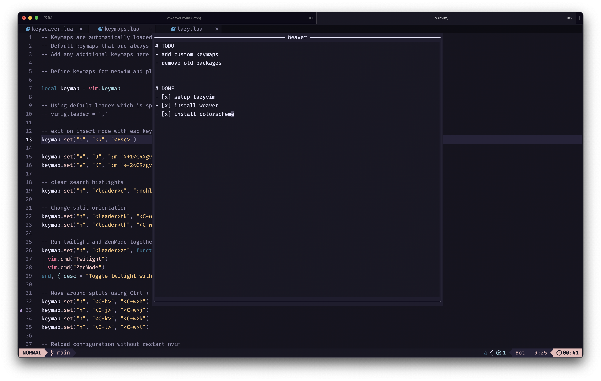

<div align=center>
  <h1>weaver.nvim</h1>
</div>



Simple note taking app for neovim that can be attached to buffers, or can be made global.

## About

This is a simple note taking plugin that creates temporary buffers that can be attached to separate buffers or create a single global buffer. Initially, I designed the plugin for myself, but I will be spending some time to update and modify it for others, refer [TODO](#todo) section for more.

## Install

Rquirements:
 - neovim >= 0.7.0
 - [plenary.nvim](https://github.com/nvim-lua/plenary.nvim) (you can add it as a dependency while installing)

Using [vim-plug](https://github.com/junegunn/vim-plug)
```viml
Plug 'nvim-lua/plenary.nvim'
Plug `genzyy/weaver.nvim`
```

Using [dein](https://github.com/Shougo/dein.vim)
```viml
call dein#add('nvim-lua/plenary.nvim')
cal dein#add('genzyy/weaver.nvim')
```

Using [packer.nvim](https://github.com/wbthomason/packer.nvim)
```lua
use {
  "genzyy/weaver.nvim",
  requires = {"nvim-lua/plenary.nvim"}
}
```

Using [lazy.nvim](https://github.com/folke/lazy.nvim)
```lua
return {
  "genzyy/weaver.nvim",
  dependencies = {
   "nvim-lua/plenary.nvim"
  }
}
```

## Usage and commands

- `Weaver`: Open a weaver attached to current buffer. This will remember the contents as long as the session is maintained and cannot be used in any other buffer.

- `CloseWeaver`: Close weaver that is attached to current buffer.

- `Weaver g`: Same as first command but with "g" passed as argument. This will create a global weaver that is not attached to any current nvim buffers and can be opened with any buffer in the session.

- `CloseWeaver g`: Close global weaver.

- `ToggleWeaver`: A toggle command to open/close weaver. Pass `g` as argument to toggle global weaver.


## ToDo

- [] Make UI better (maybe custom popup?)
- [] Better code quality
- [] Formatting and highlighting for weaver contents (markdown support?)
